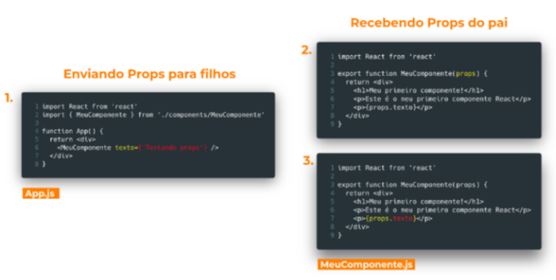

# Curso-de-React
# Aula 8

### Relebrando Componentes

`O que é um componente?`

Na prática, componentes em React são funções com algumas regras específicas:
* Importar o React no topo;
* Primeira letra do nome maiúscula;
* Deve retornar um JSX (com um único pai);
* Sintaxe de um componente ->

`Imutabilidade do React`

* No React não podemos alterar valores da mesma forma que costumávamos fazer no Javascript.
* A única forma de alterarmos valores de variáveis é através de **estado**

`Enentendo a imutabilidade na prática`
Para entender,vamos ver a implementação de um **contador** em React. Nosso exercício vai conter:
* Variável para guardar o valor de um contador;
* Número que mostra o valor do contador;
* Botão que ao ser clicado, soma 1 no valor atual.

`Relembrando retorno de funções`
* Quando queremos enviar para fora de uma função **mais de uma variável**, podemos **retonar um array** e acessar os valores do retorno através das posições do array.
* No exemplo abaixo, temos uma função com duas responsabilidades: somare multiplicar valores. E queremos retornar duas variáveis, uma contendo a soma e outra contendo a multiplicação dos dois números.
* Para utilizarmos o retorno dessa função, fazemos então a desestruturação das duas variáveis.

### `useState()`

`Mas antes... entendendo Hooks`

**useState** é um hook que permite a criação de variáveis de estados em nossas aplicações.

Já que os estados são as únicas variáveis monitoradas pelo React, são eles que utilizamos para guardar informações que precisam ter suas alterações refletidas na tela.

`useState()`

**useState()**  é uma dunção que retorna duas variáveis: uma que guarda o **estado atual** e outra variável que guarda uma **função para alterar o estado**. O estado só pode ser alterado por essa função.

`Sintaxe`

