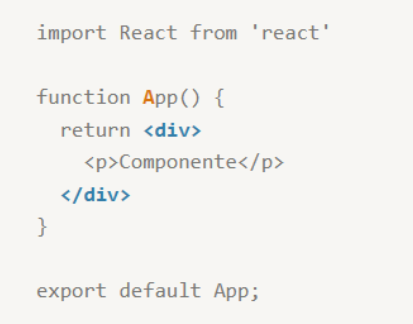
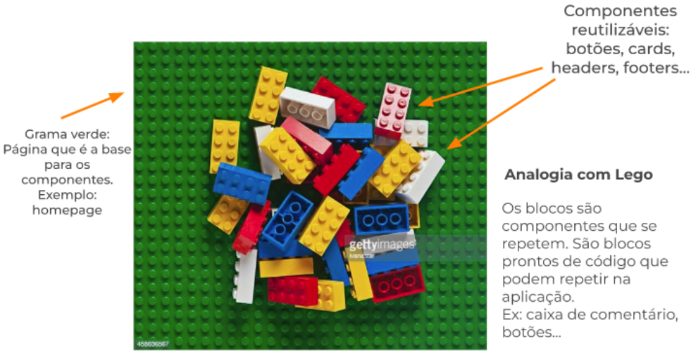
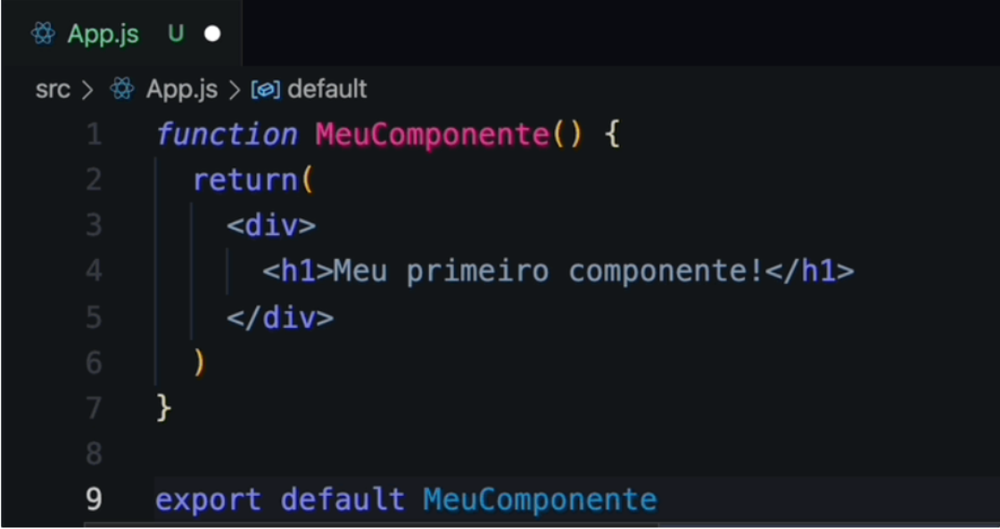
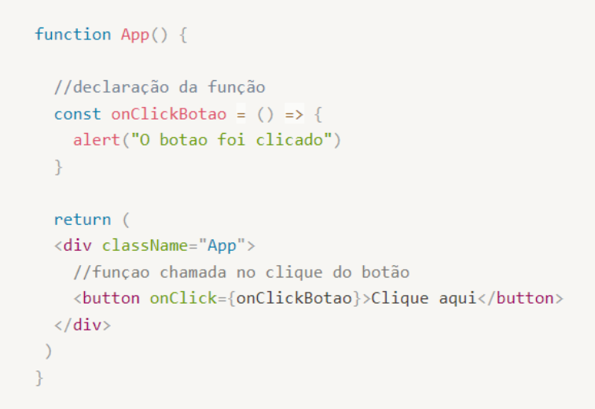
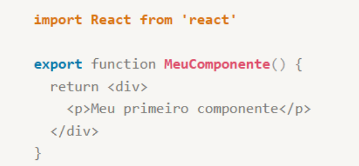
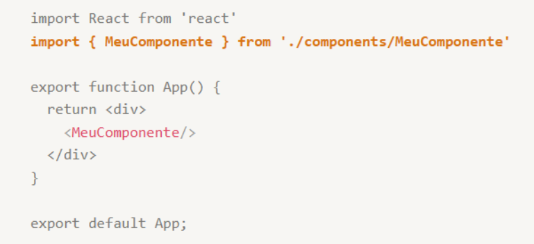

# Curso-de-React-Labenu
Curso-de-React
# Aula 1
## `Criando um projeto React`

Documentação React[ Clique aqui ](https://react.dev/)

* Para desenvolver com React, precisamos usar um programa chamado Node.

* Ele nos dá ferramentas para instalar, rodar, gerar builds e deployar nossas aplicações.

* ### `Build:` é o termo usado para identificar uma versão compilada de um programa.

* ### `Deploy:` o significado do termo depende do ambiente e da tecnologia. No React, significa disponibilizar o appna internet e torná-lo acessível ao mundo.

## `Criando um App React na prática`
* Comando: para criar um app React, basta navegar até a pasta desejada no terminal e rodar:

    `npx create-react-app nome-do-app`

* Rodando o App React
Primeiro precisamos entrar na pastado projeto:

    `cd nome-do-app`

* e depois, rodar:

    `npm start`

Create-React-APP
Documentação [clique aqui](https://create-react-app.dev/)

# JSX

* JSX é uma sintaxe que permite gerar código HTML a partir de código Javascript;
* É muito parecida com HTML, mas possui algumas particularidades;
* No momento de executar, ela é transformada em Javascript puro;
* Um componente em React é representado por uma função que retorna um JSX;

## Diferenças JSX e HTML
É possível utilizar atributos presentes em elementos HTMl.Porém, alguns nomes são levemente diferentes, abordaremos abaixo algumas diferenças:

### 1. Nomes
* class => `className`
* Atributos com múltiplas palavras viram camelCase
    * onclick => `onClick`
    * onchange => `onChange`

* exemplo:

### 2. Imagens Locais
* Antes, podiamos passar o path (caminho) da imagem, relativo ao arquivo atual, para o atributo src.
* Agora, para usar uma imagem local, é preciso **importá-la no topo do arquivo**, e só entao passar ela para src entre {chaves}.

* Sintaxe:

### 3 Valores
* Em geral, os valores dos atributos são passados da mesma forma que antes;
* Existem duas diferenças principais:
* Imagens locaisFunções de eventos (onClick, onChange, etc)
  
### 4. Funções de eventos
* Antes, era possível declarar funções no arquivo JS e referenciá-las no HTML, nos atributos de evento.
* As funções eram chamadas entre aspas e com os parênteses, por exemplo:

* Agora, podemos declarar a função no **próprio componete**, antes do return. Passamos a função **entre chaves e sem parênteses**:

`Exemplo`

### 5. Regra do Pai único
Todas as expressões JSX devem ter **um único pai**, ou seja, todo o conteúdo de um componente deve estar envolto de uma `div` ou um React Fragment `<> </>`

### 6. Expressões Javascript
* Podemos usar expressões Javascript no meio do código JSX;
* Uma expressão Javascript é tudo aquilo que representa **um único valo**;
* Para usar o valor da expressão, basta colocá-la entre {chaves}.

### 7. Self-closing Tags
São ekementos que não possuem filhos (img, input, br, hr) possuem uma sintaxe levemente diferente. Por isso, devem sequir sintaxe self-closing;

* Qualquer outro elemento que não tenha filhos pode seguir essa sintaxe.

