# Curso-de-React
# Aula 6
## styled-components

### `styled components`

Até agora, já temos HTML e JS juntos, só o CSS permanece separado. Você já deve ter percebido que é trabalhoso manter nomes e classes. Além disso, o React unifica todo o código de CSS em um arquivo só, então, temos que garantir que não iremos repetir os nomes. Isso é chato (ou até mesmo impossível);

Styled Components é uma lib (abreviação de library, ou como chamamos aqui biblioteca) que garante que o CSS de cada componente seja totalmente restrito àquele componente. Para instalar rode:

### **comando** `npm install styled-components` 

    
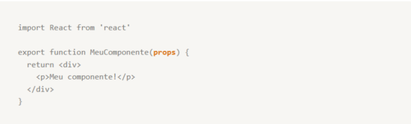

### `Exemplo com Styled-Components`

O Styled permite criarmos uma variável com o estilo CSS guardado dentro e para utilizar basta colocar o nome da variável no lugar do nome da tag.

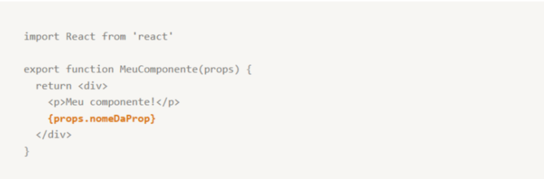

## **Boas praticas com styled-components**
### **Não usar classes com styled-components**
Quando estamos estilizando os nossos componentes usando o styled-component não devemos usar o className, o ideal é não misturar os dois, pois, o código fica confuso e quando surge um problema na estilização se torna mais difícil de resolverjá que as configurações de estilo vão estar espalhados.

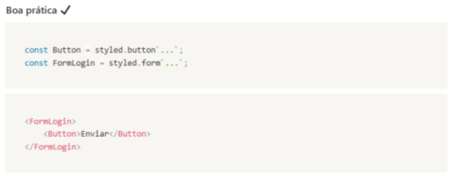

### Evitar aninhar com seletores
Você já deve ter visto/feito um componente com vários elementos dentro de outro elemento dentro de outro elemento e assim por diante. O styled-components permite que, para manter toda a estilização dentro do styled do componennte, que façamos o aninhamento dos seletores, isto é, permite criar todos os seletores que vamos estilizar dentro de uma mesma string de style.

No entando, isso acaba gerando uma grande "tripa" de código, que é difícil de ler, de entender e de fazer manutenção. Um exemplo a ser evitado abaixo.

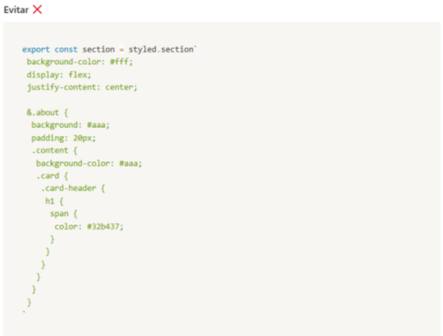

Ao invés de fazer u componente com muitos elementos internos, classes e subclasses, quebre esse componente em diversos outros componentes. Assim você irá construir um código organizado, onde cada componente faz sentido.

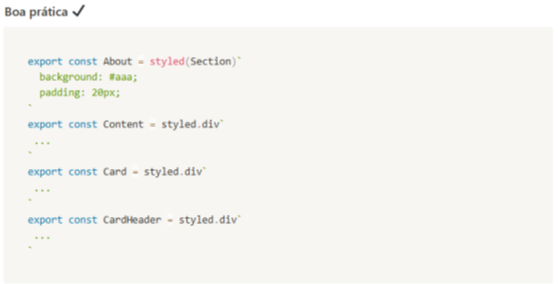

## Sobrescrever CSS
Eventualmente, especialmente quando trabalhamos com bibliotecas de terceiros (o que veremos mais a frente no curso), será necessário alterar um componente que já possui um estilo próprio dentro de alguma página do nosso site.

No geral importamos o componente que queremos alterar e criamos outro a partir dele.

A função `style(componente)` nos permite importar todo o estilo de algum elemento e aplicar no componente que estamos criando.

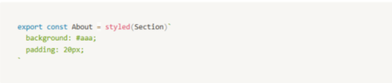

Outra possibilidade é importar dentro do ocmponente "pai" o componente "filho" que desejamos alterar. No exemplo abaixo, o nosso componente `Button` apenas terá `color: red;` dentro do componente `about`.

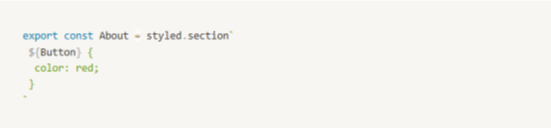

## **Bons nomes para componentes estilizados**

É importante escolher bons nomes para os styled-components que nós criamos. Podemos usar por exemplo,nomes que façam referência ao uso daquele determinado componente.

Não é uma boa prática, por exemplo, usar nomes de elementos HTML como nomes de componentes.

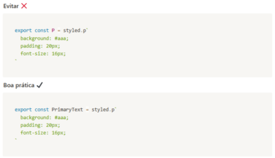

## **Crie estilos isolados**

Isso significa criar uma pagina de estilos para cada componente e page sempre que possível, dessa forma cada arquivo do seu site vai ter que acessar os seus componentes de forma mais direta e a manutenção é facilitada, isto é se você precisar fazer uma alteração nos botões, você pode ir no arquivo de estilos referentes a ele, sem se preocupar em procurar onde estão estariam essas configurações e/ou fazer alterações em diversas partes do site.

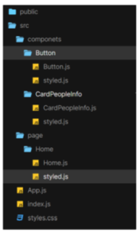

## **Crie um estilo global**

As tags HTML, por definição possuem algumas configurações padrões de estilos `margin. padding, etc` esses estilos muitas vezes nos atrapalham na hora de posicionar os nossos elementos, para resolver esse problema, nós podemos criar uma regra de estilização que vai "zerar" essas informações.

Em um arquivo separado chamado de `GlobalStyled`, com o `createGlobalStyle` do styled-components.

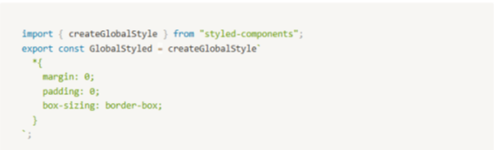

No App.js, esse componente é usado da seguinte maneira.
Lembrando que o local onde ele é adicionado no APP é irrelevante, podendo ficar dentro/fora de estados globais, rotas, etc

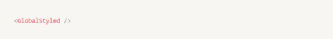

## **Crie estilos semânticos**

No momento de criar os componentes caímos na tentação d eutilizar sempre `div` como tag de agrupamento. Ignorar as tags semânticas nesse momento é um erro, uma vez que o papel das tags não é apenas estruturar documentos para a web, mas também descrever o significado do conteúdo presente nesses documentos. Podemos acessar todas as outras tags como propriedades do styled, como `styled.header, styled.nav, styled.section, styled.article, styled.aside, styled.footer` dentre outras.

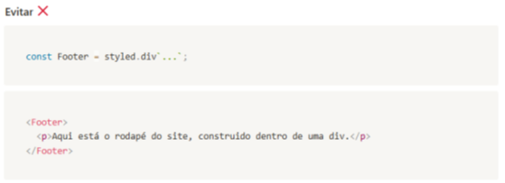
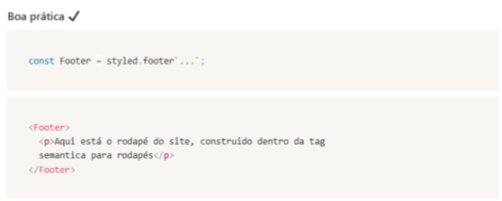

