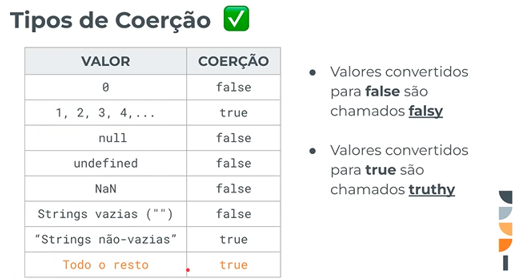
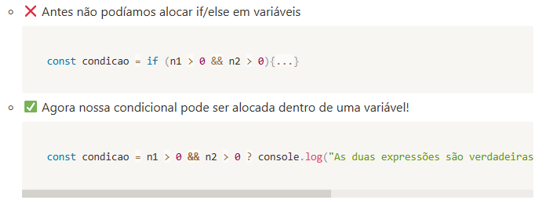
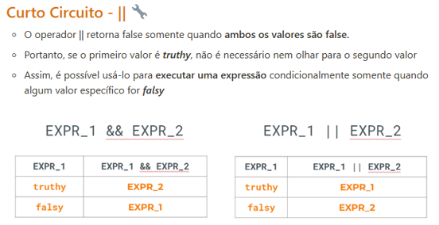

# Curso-de-React
# Aula 13

### 

Agora que já sabemos comopassar dados entre os componentes, por meio de props, vamos entender qual é a melhor forma desse fluxo acontecer!
Quando queremos compartilhar dados entre componentes que **não estão diretamente ligados** isso gera um problema! 
É importante planejar bem onde nossos dados vão ficar guardados para que os cmponentes tenha acesso guando necessário.

