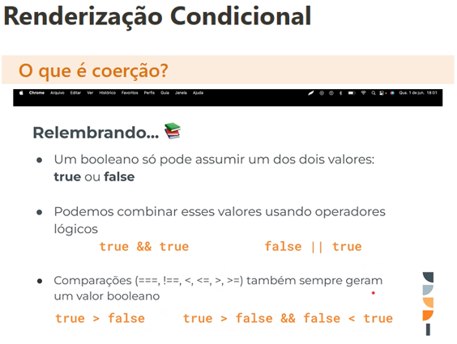
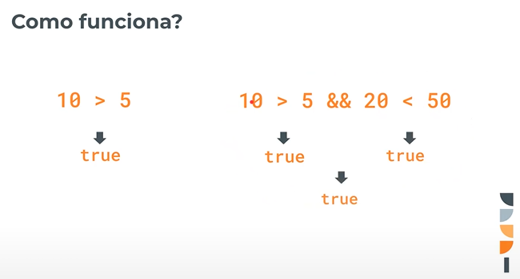
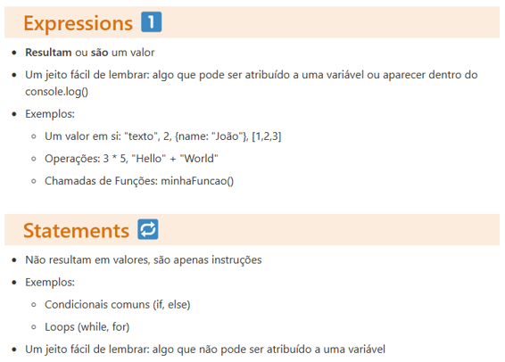
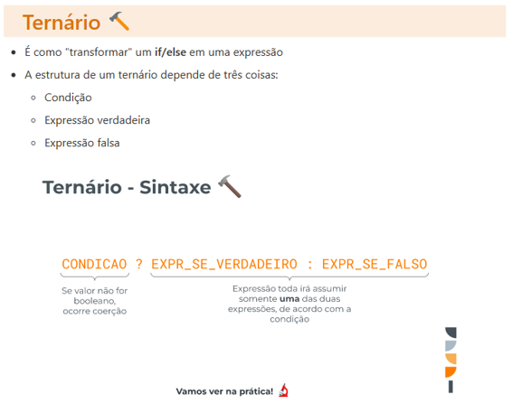

# Curso-de-React
# Aula 11 

### Relebrando Componentes

Podemos dizer que o input do HTML já possui um estado próprio (atributo value). Para trabalhar com ele corretamemte no React, queremos que o **nosso componente controle o estado do input. Essa técnica é chamada de inputs controlados**

* A função que passamos para o `onChange` recebe um `event` como parâmetro;
* O `event` é um objeto que possui `o valor (value) do input`, basta acessar por `event.target.value`

Você tem a impressão que o input está agindo da mesma maneira que no caso anterior, com o input não controlado, mas na realidade o que acontece por trás é bem diferente.

O input manda o novo valor pro estado, e o estado faz o componente renderizar o input novamente com seu valor novo.

À primeira vista, parece que o input controlado é mais complicado. De fato, é muito mais **verboso** (Você precisa escrever código a mais, pois precisa salvar o valor), mas ele é muito mais poderoso, e faz mais sentido pela forma com que o React funciona.

O React foi desenhado para ser reativo, isto é, a cada alteração simples do state ou de prop, o React irá renderizá-lo novamente.

Então agora entenda o caso: você tem um input que tem um valor pré definido, ou seja, um valor que já vem preenchido no primeiro render:

Eu não vou conseguir alterar o valor, pois o React entende que aquele valor deveria ser **`Astrodev`**. O React identifica que quando um input é montado com um `value` pré definido, este é um input controlado. Então agora ele só se atualiza por mando de algum lugar externo. Nesse caso, o nosso estado.

## Para ficar na mente: lembre-se que para controlar um input, precisamos sempre fazer 3 coisas:

* Declarar um estado para armazenar o valor do input;
* Aplicar a propriedade `value` no input;
* Criar uma função de onChange.

## Input select
A tag `<select>` permite escolher algumas opções pré-selecionadas dentro de um menu. Estas opções devem estar dentro desta tag `<select>` e envolvida pela tag `<options>`. Para controlar o input, basta incluir o `value` e o `onChange` na tag select, desta forma o value receberá o valor dentro do `<options>`

